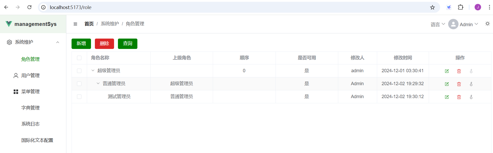
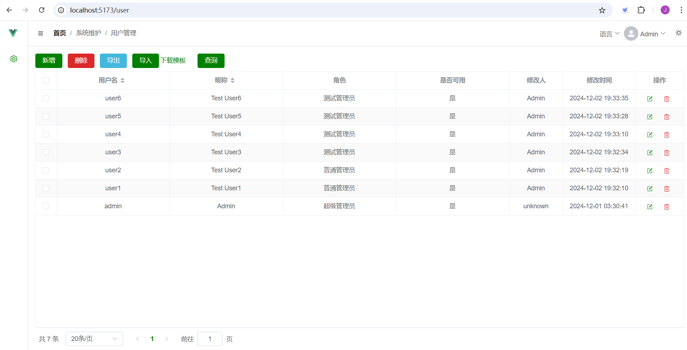
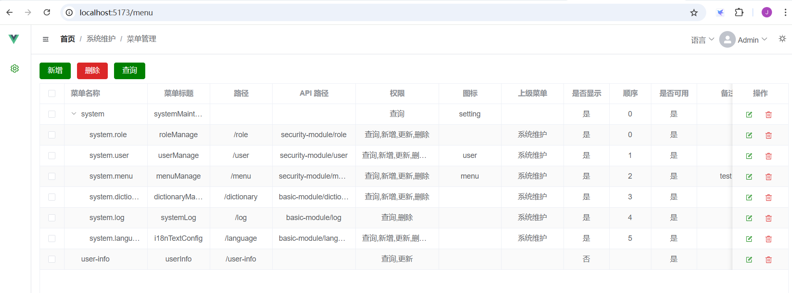
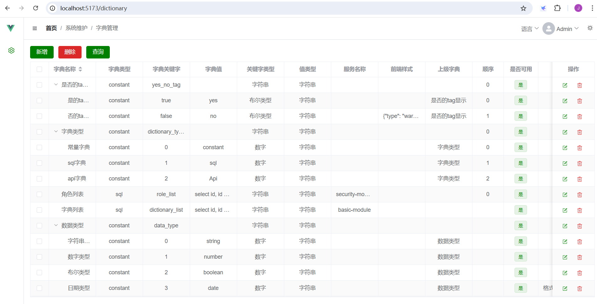
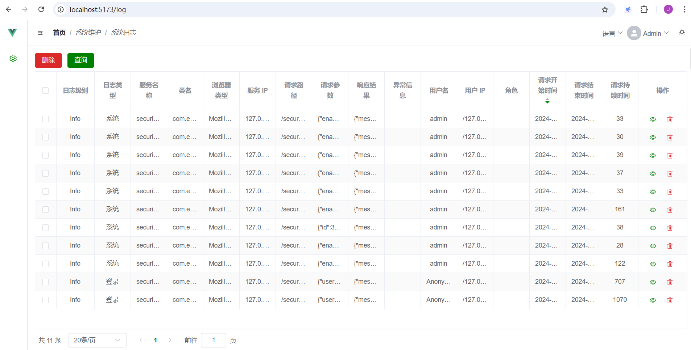
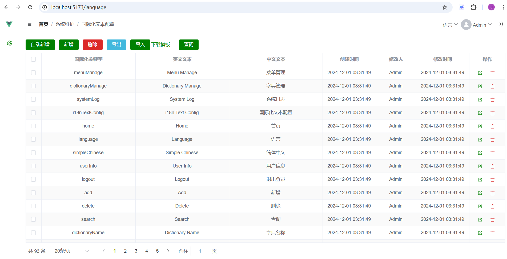
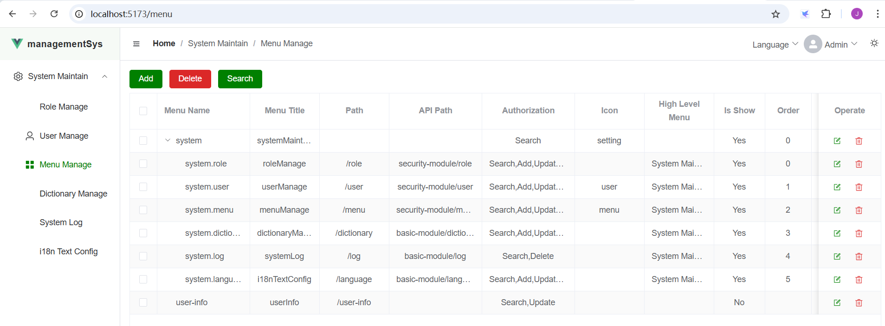
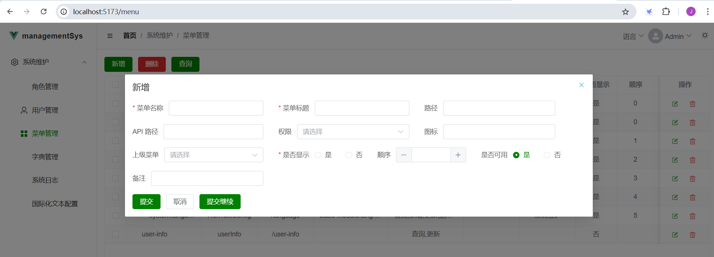

# element-ms

基于 element-plus 开发的管理系统的前端框架平台。项目用 vite4 构建，封装了方便快速开发的基本组件，可以快速的生成 CRUD 功能的界面，且支持多语言切换。可以搭配后端代码https://github.com/ahuadoreen/ManagementSystem 构成完整的管理系统的平台

## Project setup

```
npm install
```

### Compiles and hot-reloads for development

```
npm run dev
```

界面运行效果








